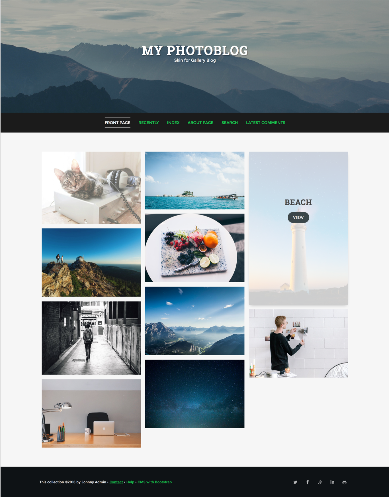

# Stain Gallery Skin

Stain is a Gallery Skin with awesome customize for every disp. Stain used fully animation for the content, fully responsive for all page, used masonry and grid layout and anymore.

## Preview




====

### Some of the Features:

- 100% Responsive Design
- Unlimited Color Schemes
- Unlimited Background Color
- 10 Background Image
- Styling All Disp Skin
- Responsive Mobile Menu
- Full Width Elements
- Full Post, Sidebar, and Grid
- One, Two and Three Column
- Photo Index Style Grid
- Masonry gallery with fullscreen popup
- Use Animation CSS
- Footer Widget
- Social Icon
- Back to top button
- Crossbrowser Compatible
- Free Updates and new features.
- Long-term Support
- And many more!

====

### Need Assistance? Get In Touch!

If you ever get stuck with setting up Cuboid with your B2evolution installation, you can get in touch with our friendly and dedicated support via our [Support Forum](http://forums.b2evolution.net/).

===

### Changes & Updates

```
Version 0.1
– Initial Version – Mei, 2016
```
