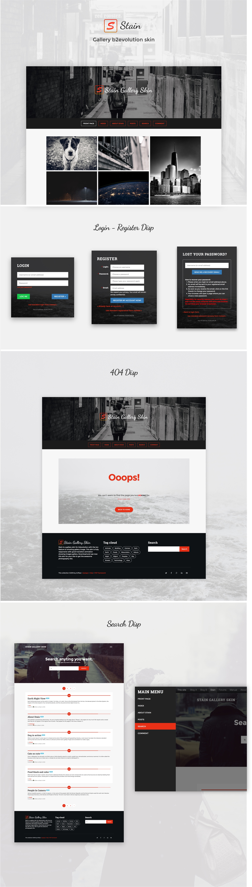

# Stain Gallery Skin

Stain – it’s a Photography Portfolio <a href="http://b2evolution.net">b2evolution</a> skin, with modern design & focus on content, we have created plenty of layout designs, skin options & different styles for disp.

The skin highlights your images which makes it great to show off your projects or photography. It includes all the flexibility you need to create your own unique b2evolution website for you brand. It’s big, full width layout & responsive design looks great on all devices and screen sizes.

====

## Preview

## Front Page

## Posts Page

## Single Page

## Media Index Page

====

### Feature Lists:

- Compatible with latest b2evolution versions
- Beautiful Responsive Design
- Fully Retina-Ready
- Unlimited Color Schemes
- Unlimited Background Color
- Custom Background Image
- Front disp Customizer
- Search disp different style
- 404 disp
- Login disp
- Register Disp
- Responsive Mobile Menu
- Full Width Elements
- One, Two and Three Column
- Masonry gallery with fullscreen popup
- Amazing Animation
- Clean and Minimalist
- Footer Widget
- Social Icon
- Back to top button
- Crossbrowser Compatible
- Free Updates and new features.
- Long-term Support
- And many more!

====

### Need Assistance? Get In Touch!

If you ever get stuck with setting up Stain with your b2evolution installation, please head over to the [Support Forum](http://forums.b2evolution.net/).
